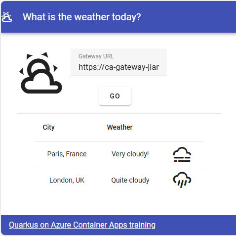

# Java Quarkus Apps on Azure Container Apps

[](https://codespaces.new/Azure-Samples/java-on-aca-quarkus)
[](https://vscode.dev/redirect?url=vscode://ms-vscode-remote.remote-containers/cloneInVolume?url=https://github.com/Azure-Samples/java-on-aca-quarkus)

The project consists of a few microservices that are deployed to Azure Container Apps using the Azure Developer CLI (azd):

* [city-service](./src/city-service/): A [Quarkus](https://quarkus.io/) application that provides a list of cities. It's backed by Azure Database for PostgreSQL Flexible Server, instrumented with OpenTelemetry, and built into Quarkus native image.
* [weather-service](./src/weather-service/): A [Quarkus](https://quarkus.io/) application that provides weather information for a given city. It's backed by Azure Database for MySQL Flexible Server, instrumented with OpenTelemetry, and built into Quarkus native image.
* [gateway](./src/gateway/): A Nginx reverse proxy. It routes requests from the frontend to the appropriate service introduced above, and also instrumented with OpenTelemetry.
* [weather-app](./src/weather-app/): A Vue.js frontend that connects to the gateway and displays the weather information for cities.

With Azure Developer CLI (azd), you’re just a few commands away from having this fully functional sample application up and running in Azure. Let's get started!

> Refer to the [App Templates](https://github.com/microsoft/App-Templates) repository Readme for more samples that are compatible with [`azd`](https://github.com/Azure/azure-dev/).



## Pre-requisites

- [Install the Azure Developer CLI](https://learn.microsoft.com/azure/developer/azure-developer-cli/install-azd)
- An Azure account with an active subscription. [Create one for free](https://azure.microsoft.com/free) if you don't have an account.
- [OpenJDK 17](https://learn.microsoft.com/java/openjdk/install)
- [Node.js with npm (20.18.0+)](https://nodejs.org/)
- [Docker](https://docs.docker.com/get-docker/)

## Quickstart

To learn how to get started with any template, follow [this quickstart](https://learn.microsoft.com/azure/developer/azure-developer-cli/get-started?tabs=localinstall&pivots=programming-language-java). For this template `Azure-Samples/java-on-aca-quarkus`, you need to execute a few additional steps as described below.

This quickstart will show you how to authenticate on Azure, initialize using a template, provision the infrastructure, and deploy the code to Azure:

```bash
# Log in to azd if you haven't already
azd auth login

# First-time project setup. Initialize a project in the current directory using this template
azd init --template Azure-Samples/java-on-aca-quarkus

# Provision and deploy to Azure
azd up
```

At the end of the deployment, you should see 4 services deployed, including **city-service**, **gateway**, **weather-app**, and **weather-service**.
Open the **Endpoint** of the service **weather-app**. Open the endpoint in a browser to see the application in action, which looks like the screenshot above.

## Application Architecture

This sample application uses the following Azure resources:

- [Azure Container Apps (Environment)](https://learn.microsoft.com/azure/container-apps/) to host 4 microservices as Container Apps
- [Azure Container Registry](https://learn.microsoft.com/azure/container-registry/) to host Docker images for 4 microservices
- [Azure Database for PostgreSQL Flexible Server](https://learn.microsoft.com/azure/postgresql/) to store the data for the *city-service*
- [Azure Database for MySQL Flexible Server](https://learn.microsoft.com/azure/mysql/flexible-server/overview/) to store the data for the *weather-service*
- [Azure Monitor](https://learn.microsoft.com/azure/azure-monitor/) for monitoring and logging

> This template provisions resources to an Azure subscription that you will select upon provisioning them. Refer to the [Pricing calculator for Microsoft Azure](https://azure.microsoft.com/pricing/calculator/) to estimate the cost you might incur when this template is running on Azure and, if needed, update the included Azure resource definitions found in `infra/main.bicep` to suit your needs.

## Application Code

This template is structured to follow the [Azure Developer CLI template creation concepts](https://learn.microsoft.com/azure/developer/azure-developer-cli/make-azd-compatible#template-creation-concepts). You can learn more about `azd` architecture in [the official documentation](https://learn.microsoft.com/azure/developer/azure-developer-cli/make-azd-compatible).

## Next Steps

At this point, you have a complete application deployed on Azure.

### Azure Developer CLI

You have deployed the sample application using Azure Developer CLI, however there is much more that the Azure Developer CLI can do. These next steps will introduce you to additional commands that will make creating applications on Azure much easier. Using the Azure Developer CLI, you can setup your pipelines, monitor your application, test and debug locally.

- [`azd down`](https://learn.microsoft.com/azure/developer/azure-developer-cli/reference#azd-down) - to delete all the Azure resources created with this template 

- [`azd pipeline config`](https://learn.microsoft.com/azure/developer/azure-developer-cli/configure-devops-pipeline?tabs=GitHub) - to configure a CI/CD pipeline (using GitHub Actions or Azure DevOps) to deploy your application whenever code is pushed to the main branch.

- [`azd monitor`](https://learn.microsoft.com/azure/developer/azure-developer-cli/monitor-your-app) - to monitor the application and quickly navigate to the various Application Insights dashboards (e.g. overview, live metrics, logs)

- [Run and Debug Locally](https://learn.microsoft.com/azure/developer/azure-developer-cli/debug?pivots=ide-vs-code) - using Visual Studio Code and the Azure Developer CLI extension

### Additional `azd` commands

The Azure Developer CLI includes many other commands to help with your Azure development experience. You can view these commands at the terminal by running `azd help`. You can also view the full list of commands on our [Azure Developer CLI command](https://aka.ms/azure-dev/ref) page.

## Telemetry Configuration

Telemetry collection is on by default.

To opt-out, set the variable enableTelemetry to false in `infra/main.parameters.json` or in bicep template `infra/main.bicep`. It can be set using the following command when the provisionning is done with Azure Developer CLI:

```bash
azd env set enableTelemetry false
```

## Reporting Issues and Feedback

If you have any feature requests, issues, or areas for improvement, please [file an issue](https://aka.ms/azure-dev/issues). To keep up-to-date, ask questions, or share suggestions, join our [GitHub Discussions](https://aka.ms/azure-dev/discussions). You may also contact us via AzDevTeam@microsoft.com.
